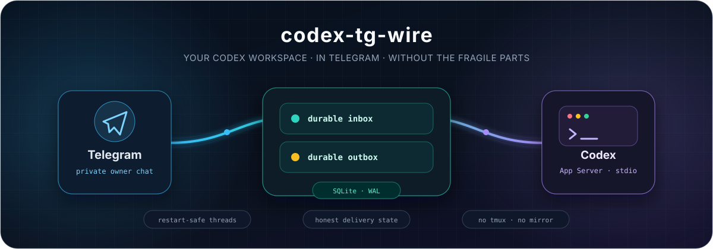

<p align="center">
  
</p>

<p align="center">
  <strong>Управляй постоянными Codex-сессиями из Telegram — и продолжай их в терминале.</strong>
</p>

<p align="center">
  Русский · <a href="README.md">English</a>
</p>

<p align="center">
  <a href="LICENSE"></a>
  <a href="plugin/docs/codex-compatibility.md"></a>
  <a href="plugin/package.json"></a>
  <a href="#release-status"></a>
</p>

<p align="center">
  <a href="#quick-start">Быстрый старт</a> ·
  <a href="#usage">Как пользоваться</a> ·
  <a href="#use-cases">Сценарии</a> ·
  <a href="#features">Возможности</a> ·
  <a href="#architecture">Архитектура</a> ·
  <a href="#comparison">Сравнение с Dashi</a> ·
  <a href="#documentation">Документация</a>
</p>

---

Отправь Codex задачу вдали от компьютера, следи за выполнением, отвечай на
approvals, смотри diff, а потом продолжай тот же thread локально. codex-tg-wire —
owner-only self-hosted мост для настоящей работы с кодом, а не stateless
чат-обёртка.

| Контекст остаётся | Управление под рукой | Падения не замалчиваются |
|---|---|---|
| Продолжай нативные Codex threads из Telegram или возвращай их в `codex resume`. | Останавливай, steer-ь, ставь в очередь, делай review и меняй model/sandbox кнопками. | SQLite inbox/outbox, restart recovery и явные `UNKNOWN`/`AMBIGUOUS` не дают тихо потерять или опасно повторить работу. |

<a id="quick-start"></a>
## Быстрый старт

Нужны **Linux с systemd --user** и **Telegram bot token** от `@BotFather`.
Installer при необходимости сам поставит закреплённый Bun в `~/.bun`, подтянет
совместимый Codex CLI и автоматически переиспользует локальный аккаунт из
`~/.codex`, если он уже есть. `sudo` не используется.

```bash
git clone https://github.com/aipolukhin/codex-tg-wire.git
cd codex-tg-wire
./install.sh
```

Консоль спрашивает только token, ставит user service и показывает одноразовую
ссылку на уже работающего бота. Нажимаешь там **START**: бот сам закрепляет твои
private user/chat IDs, предлагает создать/использовать `~/codex-workspace` либо
ввести другой абсолютный путь и выбрать **YOLO** или **Safe**. Случайный nonce в
ссылке не даёт чужому обычному `/start` перехватить ownership.

После этого сервис сам перезапускается в полноценный bridge. Продолжаешь по
кнопке в Telegram: **Подключить Codex** открывает device login только при
отсутствии локальной авторизации, **Проверить вход** проверяет её, **Создать Groq
key** опционально включает транскрипцию, а **Начать первую задачу** завершает
onboarding. После ввода token терминал больше не нужен. Для основного сценария
не требуются `sudo`, отдельный Unix user или Docker.

```text
/start
```

Хочешь контейнер — Docker остаётся опцией, а не default-путём:

```bash
./docker.sh setup
```

Config, SQLite и `CODEX_HOME` остаются на host, runtime работает в hardened
non-root container. Installer монтирует `~/codex-workspace` по умолчанию либо
абсолютный `--project`; в боте остаётся подтвердить project и выбрать режим.
Codex login тоже проходит в боте, а `./docker.sh login` нужен только как
аварийный fallback.

> [!CAUTION]
> Рекомендуемый профиль — **YOLO**: `approvalPolicy=never` и
> `sandbox=danger-full-access`. Это удобно, но тот, кто получит контроль над
> разрешённым Telegram account, сможет действовать с правами твоего
> Linux-пользователя. Утечка bot token также раскрывает bridge traffic и требует
> реакции как на incident. Выбери **Safe** в onboarding или запусти
> `./install.sh --profile safe` для `on-request` + `workspace-write`.

[Подробная установка](plugin/docs/codex-installation.md) ·
[Docker и production deployment](plugin/docs/codex-installation.md#docker-compose-installation)

<a id="features"></a>
## Что умеет мост

### Codex как удалённый workspace

| Я хочу… | Что отправить в Telegram |
|---|---|
| Начать или продолжить работу | Обычное сообщение, `/new`, `/sessions`, `/attach <thread-id>` |
| Вернуться в терминал | `/handback` напечатает безопасно экранированную команду `codex resume` |
| Управлять активным turn | `/stop`, `/steer <текст>` или выбор steer/queue/replace/cancel при занятости |
| Изменить режим выполнения | `/settings`: model, effort, sandbox, approvals, project и Guided Plan |
| Проверить результат | `/diff [path]`, `/file [--all] <path>`, `/review` |
| Проверить аккаунт | `/auth`, `/login`, `/limits`, `/usage`, `/version` |
| Управлять нативными сессиями | `/rename`, `/archive`, `/unarchive`, `/fork`, `/compact` |

Пока Codex работает, тихий закреп показывает только время, модель, лимиты и
заполнение контекста. Этапы и текущее действие в закреп не попадают. Для
многошаговой работы Codex создаёт отдельный Rich Message **«Ход задачи»** и
редактирует эту карточку сразу после каждого проверенного шага.
В ту же карточку попадают пользовательский комментарий, текущая операция и
время её выполнения. Например: `rsync переносит 80 ГБ · выполняется 18 мин`.
Минутный heartbeat обновляет время и показывает, что turn не завис.

Reply на доставленный ответ Codex направляет следующее сообщение точно в thread,
который создал этот ответ — даже если позже была выбрана другая сессия.

### Обсудить идею без случайного запуска разработки

Фразы вроде «давай обсудим», «твои предложения?» и «как лучше это сделать?»
открывают durable-обсуждение в read-only. Пока оно открыто, новые требования
остаются частью разговора и не запускают реализацию. Последняя рекомендация
становится согласуемым scope: нажми **Реализовать** или дай недвусмысленную
контекстную отмашку.

Отдельная прямая команда вроде «почини отправку картинок» по-прежнему
выполняется сразу. `/plan on` включает обязательное подтверждение для каждой
новой задачи. Оба сценария используют один durable gate:

```text
обсуждение в read-only → уточнить или закрыть → подтвердить scope → выполнить
```

Planning и revision принудительно работают с `sandbox=read-only` и
`approvalPolicy=never`. Workspace становится доступен для записи только после
кнопки **Реализовать**. Незакрытое обсуждение и выбранное действие переживают restart.

### Настоящие файлы проекта

- изображения и аудио передаются нативными inputs App Server;
- комментарий, набранный перед пересылкой поста или альбома,
  объединяется с ним в один Codex turn;
- разрешённые документы проверяются, приватно сохраняются и доступны по safe path;
- media group превращается в один atomic Codex turn;
- `/file --all` отправляет файл проекта через тот же durable outbox;
- optional Groq transcription дополняет voice input, не заменяя оригинальное
  аудио, доступное Codex.

<a id="usage"></a>
## Как пользоваться

1. Один раз отправь `/start` и иди по action buttons. Существующий host Codex
   auth подхватится автоматически; иначе нажми **Подключить Codex** и заверши
   browser login. Groq voice можно пропустить.
2. Пришли задачу обычным сообщением. Мост создаст или продолжит нативный Codex
   thread в выбранном проекте и будет обновлять одну progress card.
3. На запросы Codex отвечай inline-кнопками. Если во время turn пришло новое
   сообщение, выбери **Уточнить текущий**, **Поставить следующим**, **Остановить
   и заменить** или **Отменить сообщение**.
4. В `/settings` меняются model, effort, sandbox, approvals, проект и Guided
   Plan. `/diff`, `/review` и `/file` позволяют проверить и забрать результат.
5. `/sessions` подключает другой нативный thread, а `/handback` даёт безопасно
   экранированную команду `codex resume`, чтобы продолжить тот же контекст в
   терминале.

Команды остаются для power users, но onboarding и частые решения построены на
конкретных действиях, а не на запоминании синтаксиса.

<a id="use-cases"></a>
## Пять рабочих сценариев

### 1. Сделать фичу без преждевременной записи в проект

Открой `/settings`, нажми **Guided Plan · On** и отправь: «Добавь passwordless
login, тесты и документацию». Codex подготовит план в read-only. Нажми
**Изменить план**, **Выполнить план** или **Отменить**; после выполнения проверь
`/diff`, запусти `/review` и запроси изменённый файл через `/file`.

### 2. Поправить live hotfix с телефона

Пришли screenshot ошибки и попроси диагностировать production behavior. Пока
идёт turn, отправь уточнение и нажми **Уточнить текущий**, чтобы оно попало ровно
в этот turn. Независимую задачу поставь через **Поставить следующим**; `/stop` —
аварийный тормоз. Reply на старый ответ возвращается в создавший его thread, а
не в случайно выбранную сейчас сессию.

### 3. Превратить материалы с места событий в coding task

Отправь фото, разрешённый log/document или Telegram media group и добавь caption.
Они станут одним durable turn с проверенными локальными файлами. Follow-up можно
надиктовать: Codex всегда получит оригинальное audio, а optional Groq добавит
транскрипт после подключения из onboarding card.

### 4. Восстановиться после падения сервера или сети

Перезапусти сервис или container во время долгого turn. Мост сверит сохранённый
Codex turn и не запустит молча дубль. `/status` покажет восстановленный thread,
а `/failed` и `/ambiguous` вынесут проблемы доставки в problem center, где retry,
resolve и archive разрешены только на безопасной границе.

### 5. Перенести ту же сессию между Telegram и рабочим столом

Начни refactor в Telegram, посмотри расход через `/usage`, затем вызови
`/handback` и продолжи тот же нативный thread локально. Позже `/sessions` найдёт
его, `/attach` вернёт в бота, а `/fork`, `/compact`, `/rename` и `/archive`
управляют lifecycle без копирования диалога во второе хранилище.

<a id="architecture"></a>
## Как это работает

```text
Telegram update
      │
      ▼
SQLite/WAL inbox ──► session coordinator ──► codex app-server --stdio
      │                                              │
      └──── problem center ◄── SQLite/WAL outbox ◄───┘
```

В Codex runtime нет tmux, terminal mirror и transcript classifier. Bridge-сервис
сам поднимает локальный App Server как дочерний процесс и общается с ним по stdio.

| Состояние | Источник истины |
|---|---|
| Полный возобновляемый Codex thread | Локальное хранилище Codex в `CODEX_HOME` |
| Принятые Telegram updates и polling cursor | SQLite/WAL inbox моста |
| Очереди, настройки, approvals и recovery state | Control tables в SQLite/WAL |
| Sends, edits, media и доказательство доставки | SQLite/WAL outbox моста |
| Диалог с пользователем | Telegram messages; это не второй полный Codex transcript |

<details>
<summary><strong>Что происходит при падении?</strong></summary>

| Граница | Поведение |
|---|---|
| Telegram повторил update | Уникальный `(bot_id, update_id)` схлопнет дубль. |
| Процесс умер до начала отправки | Lease вернётся в bounded retry. |
| Telegram мог принять send, но ответ потерялся | Job станет `AMBIGUOUS` и не будет автоматически повторён. |
| App Server исчез во время turn | Сохранённый turn сверяется через `thread/read`. Доказанное прерывание автоматически продолжает ту же logical operation в том же thread; неопределённость становится видимым `UNKNOWN` и не повторяется автоматически. |
| Нужно восстановить delivery | `/failed` и `/ambiguous` показывают безопасные metadata и идемпотентные retry/resolve/archive actions. |

codex-tg-wire не обещает невозможный end-to-end exactly-once. Он сохраняет
доказательства, показывает неопределённость и запрещает опасный retry, когда
нельзя исключить дублирование.

</details>

<a id="comparison"></a>
## codex-tg-wire и Dashi

codex-tg-wire начался с TypeScript/Bun и Telegram UX из Dashi, но сейчас это
отдельный продукт с другим runtime и reliability model.

| | codex-tg-wire | Dashi |
|---|---|---|
| Agent runtime | Нативные threads/turns Codex App Server | Claude Code session через channel/tmux lifecycle |
| Session storage | Codex `CODEX_HOME`, attach/fork/compact и local handback | Claude transcript и состояние live terminal/tmux |
| Delivery state | Transactional SQLite/WAL inbox/outbox, leases и ambiguity handling | File-oriented queues и transcript-based fallbacks |
| Telegram focus | Приватный allowlisted workflow одного владельца | Более полный multichat, groups/topics и personas |
| Native controls | Codex account, usage, limits, sessions, diff и inline review | Claude hooks, terminal mirror, `/keys`, `/cc` |
| Кому подходит | Владельцу, которому нужен durable Codex workstation в Telegram | Claude-centric командам, которым важна широкая chat surface Dashi |

Мы сознательно не переносили tmux transport, Claude hooks, Guest Mode, публичные
чаты, fleet orchestration и полный Dashi multichat. Мотивация описана в
[карте происхождения и исключений](docs/provenance.md).

## Безопасность в двух словах

- user/chat allowlists обязательны и работают deny-by-default;
- tokens не попадают в JSON и SQLite;
- paths ограничены configured projects и перепроверяются перед использованием;
- исходящий текст проходит redaction, Telegram HTML — validation;
- любая send/edit/delete/reaction/media mutation идёт через durable outbox;
- retention очищает старые completed payloads, diffs и reply routes;
- Safe и YOLO — явные профили, а не скрытое поведение.

Перед публикацией мощного coding agent в Telegram прочитай полный
[security contract](plugin/docs/codex-security.md).

<a id="documentation"></a>
## Документация

| Документ | Когда нужен |
|---|---|
| [Установка](plugin/docs/codex-installation.md) | user-systemd, system-wide systemd или Docker Compose |
| [Production runbook](plugin/docs/codex-production.md) | readiness, backup/restore, retention и live soak |
| [Upgrade и rollback](plugin/docs/codex-upgrade.md) | переход между verified artifacts без риска для БД |
| [Security contract](plugin/docs/codex-security.md) | trust boundaries, secrets и incident handling |
| [Compatibility](plugin/docs/codex-compatibility.md) | точные версии Codex CLI, Bun и App Server schema |
| [Roadmap](ROADMAP.md) | закрытые milestones и post-v1 направление |
| [Provenance](docs/provenance.md) | что пришло из Dashi, Telemax и других референсов |

<a id="release-status"></a>
## Статус релиза

Реализация v1 и artifact gate install → restart → resume завершены. Проект
остаётся **hardened pre-release**, пока не пройдены чистая операторская установка
и реальный 72-часовой Telegram/Codex canary. Сейчас поддерживаются private
allowlisted-чаты и локальный stdio App Server. Groups, topics, fleet orchestration
и remote App Server transport относятся к post-v1.

<details>
<summary><strong>Разработка и проверки</strong></summary>

```bash
cd plugin
bun install --frozen-lockfile
bun run typecheck
bun test
bun run codex:schema:check
```

Полезные operator checks:

```bash
bun run doctor:codex --online
bun run backup:codex -- /safe/path/bridge.sqlite3
bun run acceptance:codex
bun run release:codex
```

Production entry point — `bun run start:codex`. Часть унаследованных Claude
modules пока остаётся в source tree во время extraction общих Telegram
primitives; Codex entry point их не загружает.

</details>

## Происхождение и лицензия

Telegram UX baseline взят из
[Dashi](https://github.com/qwwiwi/dashi-plugin-claude-code). Durable delivery
semantics сформированы с учётом [Telemax](https://github.com/aipolukhin/telemax)
и заново реализованы на TypeScript; Python-код не копировался. Репозиторий
сохраняет upstream history и Apache-2.0 attribution — см. [NOTICE](NOTICE) и
[provenance map](docs/provenance.md).

codex-tg-wire — независимый неофициальный проект, не связанный с OpenAI или
Telegram.
